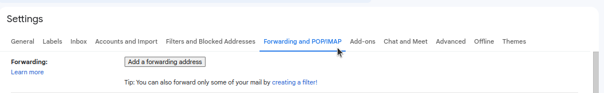

# Mail Service

### this is a basic mail service, the main purpose it's to implemented send emails in portfolio contact.

# ℹ️ Notes

- if you can contribuite with a new endpoints or logic, send a pull request.
- if you like this repo and it's usefull for your, give me a start 🌟
___

# 🚀 Getting started

### Clone this repository

```bash
git clone https://github.com/FelipeGCx/Mail-Service.git
```

### Install Dependecies

```
npm install
```

### Run Dev Serve

```
npm run dev
```

### Compiles for production

```
npm run build
```
---
# 📨 Setting Gmail

### Go to Gmail and Open settings


### Open "See all settings"


### Navigate to "Forwarding and POP/IMAP"



### Scrolling to "IMAP Access and Enable IMAP"


---
# 🖋 Postdata

### Remember create .env file an use [.env.example](.env.example) as reference
